# Network Intrusion Detection System (NIDS) with Deep Learning

This repository contains the complete implementation of a Network Intrusion Detection System (NIDS) using Machine Learning and Deep Learning (PyTorch) techniques. The project is based on the **NSL-KDD** dataset and covers the entire workflow: from exploratory data analysis and preprocessing to neural network training, ablation study, and a real-time inference module.

---

## Table of Contents
1. [Data Loading and Exploration](#1-data-loading-and-exploration)
2. [Data Preprocessing and Balancing (Undersampling)](#2-data-preprocessing)
3. [MLP Model Architecture and Training](#3-mlp-model-training)
4. [Performance Evaluation](#4-performance-evaluation)
5. [Real-Time Inference Interface](#5-inference-interface)
6. [Ablation Study and Experiments](#6-ablation-study-and-experiments)

---

## 1. Data Loading and Exploration

The system utilizes the **NSL-KDD** dataset (hosted on Kaggle). Because the original files do not contain a header, the columns were mapped manually to ensure correct processing.

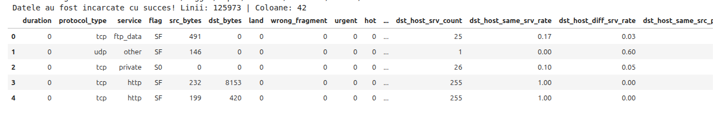
*Figure 1: Visualization of the detected files and the first rows of the dataset.*

A crucial step was understanding the class distribution. The NSL-KDD dataset is known for its major class imbalance, with a predominance of `normal` traffic and `neptune` attacks.

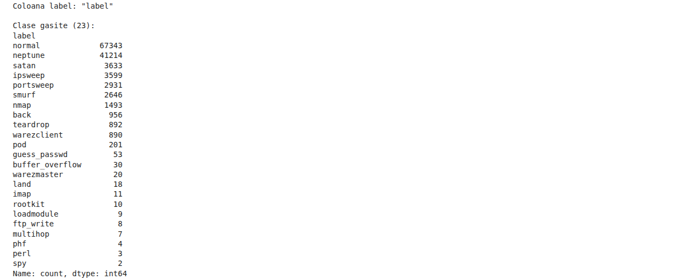
*Figure 2: List of identified classes and the number of records.*

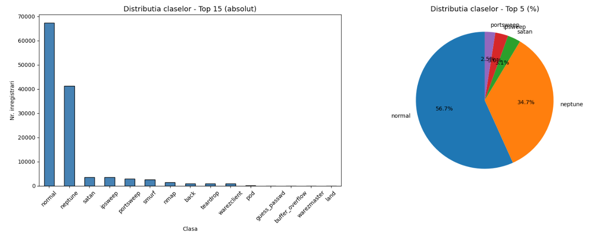
*Figure 3: Class distribution - top 15 absolute traffic and percentage distribution.*

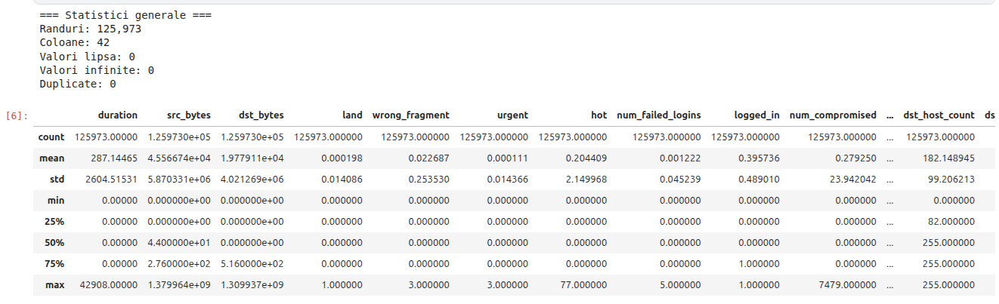
*Figure 4: Descriptive statistics of the raw dataset.*

---

## 2. Data Preprocessing

To obtain an accurate model, the raw data was cleaned by:
* Removing infinite values (`inf`) and duplicate rows.
* Dropping columns with zero variance (which provide no useful information).
* Encoding categorical features (`protocol_type`, `service`, `flag`) using `LabelEncoder`.
* Removing classes with fewer than 10 examples to allow for a stratified split (Train/Test split).

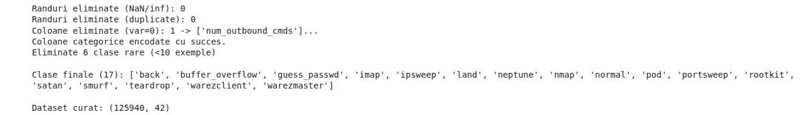
*Figure 5: Results of the data cleaning process.*

### Undersampling and Data Splitting
To prevent the network from only recognizing the majority classes, **Undersampling** (`RandomUnderSampler`) was applied, limiting the maximum number of records to 50,000 per class.
The dataset was split into **70% Training, 15% Validation, 15% Testing**, and the features were normalized using `StandardScaler`.

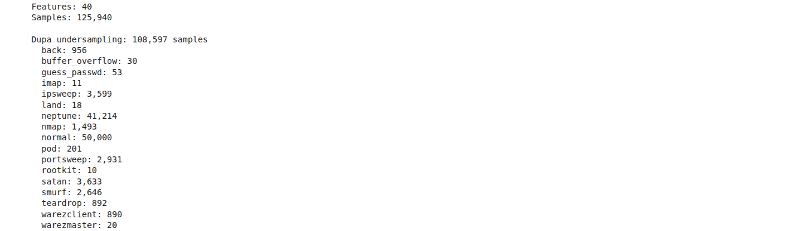
*Figure 6: The new class distribution following the Undersampling process.*

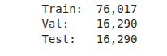
*Figure 7: Size of the training, validation, and testing subsets.*

---

## 3. MLP Model Architecture and Training

A **Multi-Layer Perceptron (MLP)** network was implemented using the PyTorch framework.
**Initial Architecture:** `Input -> 256 -> BatchNorm -> Dropout(0.3) -> 128 -> BatchNorm -> Dropout(0.3) -> 64 -> Num_Classes`.

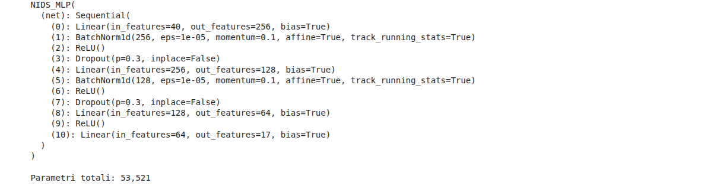
*Figure 8: MLP model architecture and total number of parameters.*

The model was trained for 30 epochs with a Learning Rate of `0.001`, using a loop that validates and automatically saves the best model (`best_state`) based on the validation set accuracy.

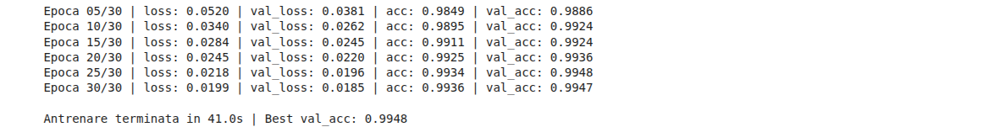
*Figure 9: Training loop history displayed in the console.*

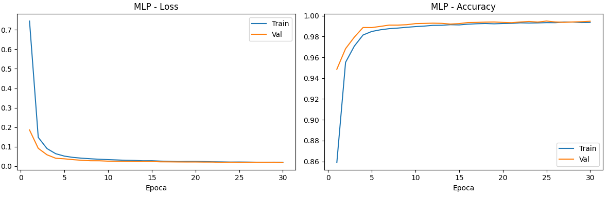
*Figure 10: Training curve graphs (Loss and Accuracy) across epochs.*

---

## 4. Performance Evaluation

The final performance was evaluated on the test set (completely unseen data for the network), achieving an excellent score and precise classification of various types of attacks.

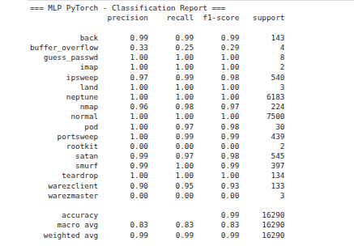

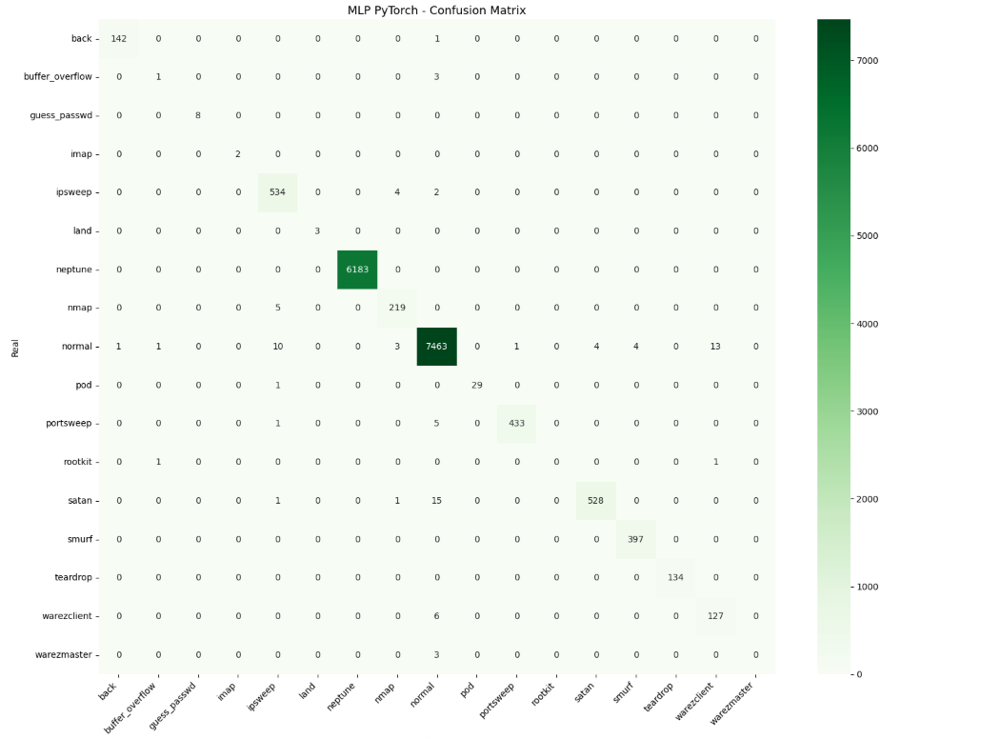
*Figure 11: Classification report (top) and Confusion Matrix (bottom) indicating where the model made errors.*

---

## 5. Real-Time Inference Interface

A custom function was created to simulate a **real-time inference system**. The script takes the raw features of a network flow, scales them automatically, and predicts the traffic type, providing the confidence level and the top 3 probabilities.

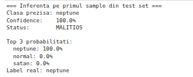
*Figure 12: Prediction simulation using the custom inference function.*

The models (`.pth` and `.pkl`) and scaling functions were saved locally via `joblib` to be easily portable.

---

## 6. Ablation Study and Experiments

To justify the architectural choices, an ablation study was conducted to analyze the impact of certain hyperparameters:

### Experiment 1 & 2: Without Dropout and Increased Learning Rate
* **Without Dropout:** Removing the regularization layers leads to faster learning but predisposes the model to overfitting.
* **LR = 0.01:** Massively increasing the learning rate causes severe instability in the optimizer (visible on the Loss curves).

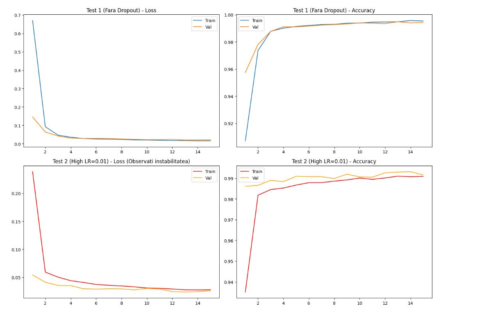
*Figure 13: Graphical comparison for the lack of Dropout and increased LR.*

### Variant 2 (Optimized)
We built a much simpler model (`Input -> 64 -> 32 -> Num_classes`), without Dropout and with a faster LR (`0.005`).

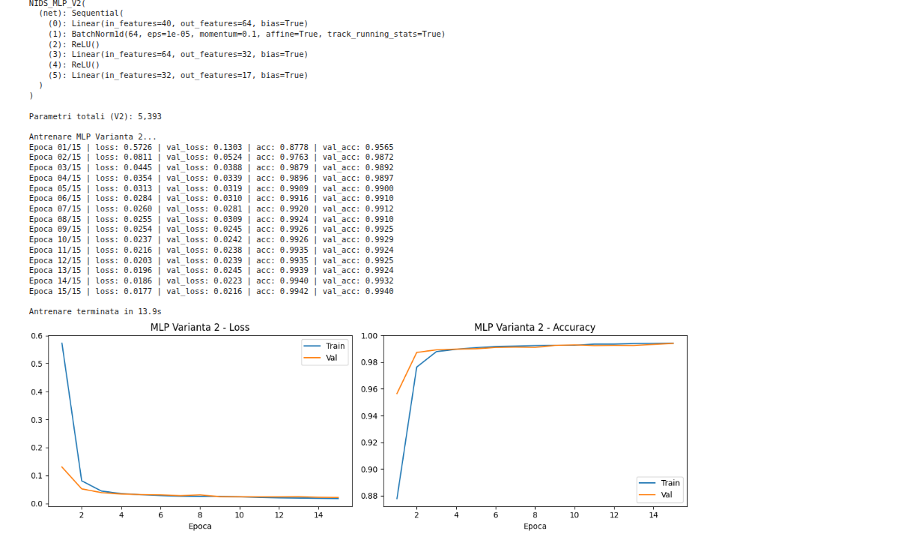

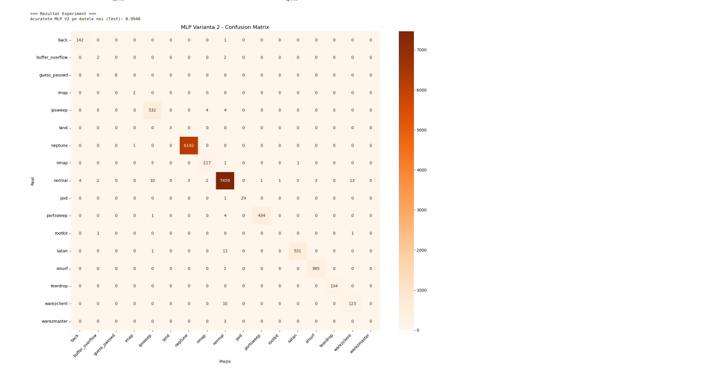
*Figure 14: Training curves and Confusion Matrix obtained with the simplified MLP variant.*

Although it trains faster, the lack of Dropout and parameter reduction slightly affected the detection of highly minority classes, proving that the initially chosen complex architecture is optimal.
